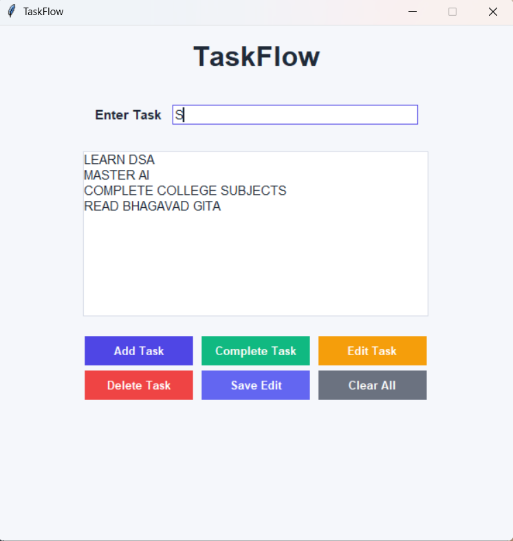
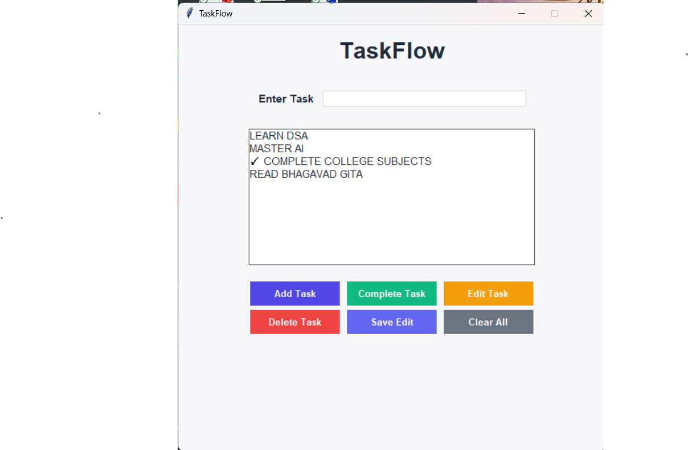
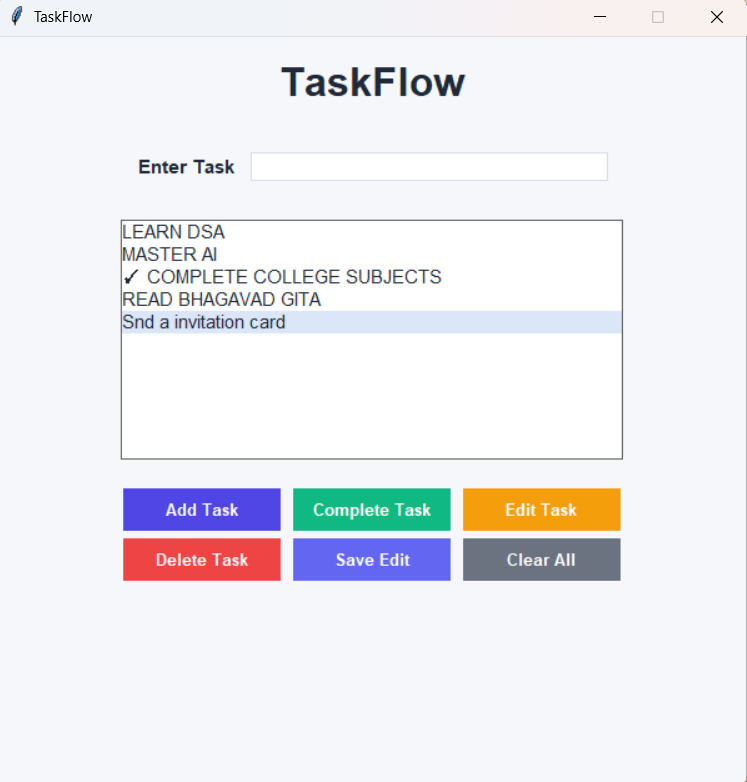
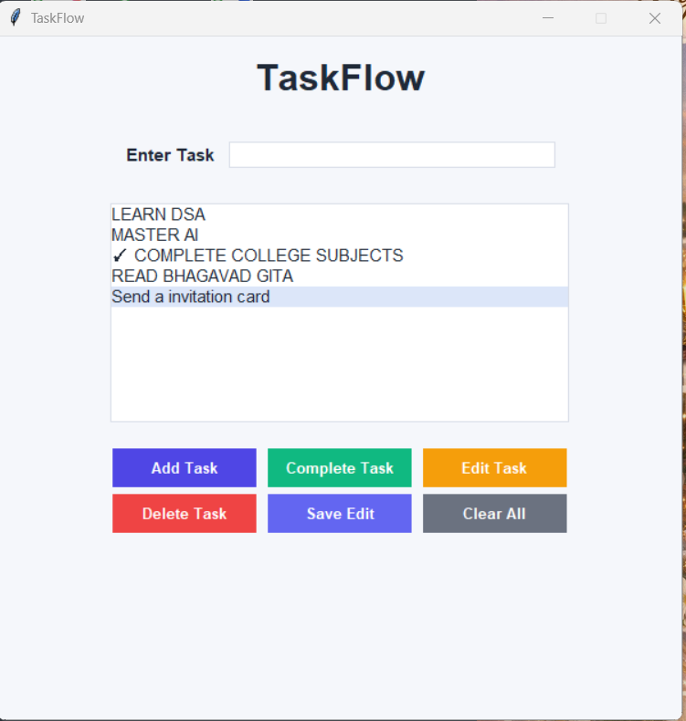

# TaskFlow 📝

TaskFlow is a simple desktop productivity application built with Python and Tkinter.

It allows users to create, edit, complete, and delete tasks through a clean graphical user interface.

## Features

- Add new tasks
- Edit existing tasks
- Mark tasks as completed
- Delete individual tasks
- Clear all tasks
- Prevent empty tasks from being added
- Press Enter to quickly add a task
- Simple and user-friendly GUI

## Technologies Used

- Python
- Tkinter

## How It Works

1. Enter a task in the input field.
2. Click **Add Task** or press **Enter** to add it to the task list.
3. Select a task to edit, complete, or delete it.
4. Use **Clear All** to remove all tasks from the list.

## What I Learned

Through this project, I learned:
- Creating desktop GUIs using Tkinter
- Working with functions and event-driven programming
- Using Tkinter widgets such as Entry, Button, Label, Listbox, and Frame
- Handling user input and validation
- Working with Listbox selection and indexing
- Connecting buttons and keyboard events to functions
- Structuring a small Python application cleanly
- Improving the usability and appearance of a desktop application

## How to Run

1. Make sure Python is installed.
2. Clone this repository.
3. Open the project folder in your terminal.
4. Run:

```bash
python main.py
```

## Screenshots

### Main TaskFlow Interface



### Completed Task



### Edit Task



### Save Edited Task



## Future Improvements

- Add task persistence using SQLite
- Add task categories and priorities
- Add due dates and reminders
- Add task filtering and sorting
- Improve task management with a more advanced interface


